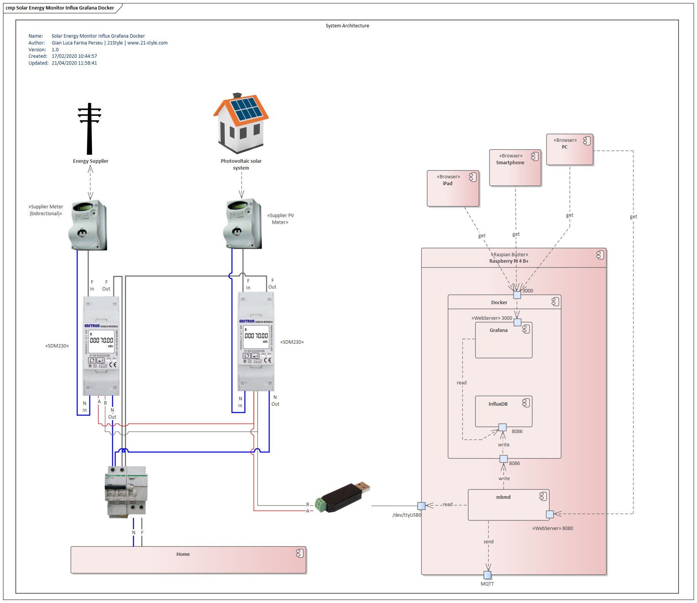

# Solar Energy Monitor Influx Grafana Docker
Solar and Energy Monitoring with Influx (InfluxDB) and Grafana in Docker environment with Raspberry PI

# Overall

This project aims to monitor the production of energy from a photovoltaic solar system (PV), total consumption and self-consumption.

In particular, using only two energy meters it is possible to obtain 5 measurements:

1) solar production (produced)
2) energy taken from the supplier (imported)
3) energy fed into the grid (exported)
4) total energy consumed (total)
5) self-consumption energy (self)

The hardware components used (and tested) in this project are:

1) one Raspberry PI 4 (4Gb Model)
2) two Energy Meter Eastron SDM230 with Modbus
3) one RS485 to USB adapter

This project can be adapted to different hardware with few changes. 
A Raspberry PI 3 can also be used, different Eastron Meters are supported, different USB/RS485 can be used. 

If anyone will use different gears, please advice me in order to update this pages and the tested hardwares.

# Architecture

Current implementation architecture (v1.0) is described in the following diagram:

 

Here a description of all the architecture components:

- **SMD230 Import-Export (SDM1)**: connected after the Energy Supplier meter, it tracks imported and exported energy (total from installation date, in kwh) and current imported (when positive) or exported (when negative) energy (power, in kw).

- **SDM230 Production (SDM2)**: connected after solar inverter and Energy Supplier meter, it records all produced energy (total from installation date, in kwh) and current production , always positive. When negative is related to inverter consumption when production is zero: normally this value is ignored.

- **Raspberry PI 4 (or 3) model**: the core of all the architecture, it contains all the software in order to elaborate the values from SDM and to reproduce in graphs form on any device (smartphone, tablet, personal computer). Installed with ***plain Raspian distro***.

- **RS485 to USB adapter**: used to connect Modbus output from SDM to the Raspberry. Normally mapped as device `/dev/ttyUSB0` 

No other hardware components are needed.

On the software side:

 - **Docker**: used v19.03.6 release. Manage a great environment for easy installation and applications isolation.
 - **MBMD** (ModBus Measurement Daemon): used v0.0.8 release. Read data from RS485 to USB adapter and write to InfluxDB. An open project written in Go language, with powerful features and opportunity to send data via MQTT. [Link to project MBMD.](https://github.com/volkszaehler/mbmd)
 - **InfluxDB for docker**: used v1.7.9 release. It stores all the data coming from SMDs in a timeseries format for fast search. 
 - **Grafana for docker**: used v6.7.1 release. It create beautiful graph based on the data stored in InfluxDB.

# Installation

Order is not inportant (apart Docker), but raccomended.

All following commands must be sudoed. Enter as root with:

    sudo su -

## Docker installation

Docker can be easily installed with one command:

    curl -sSL https://get.docker.com | sh

Check with 

    docker -v

if all is done.

## InfluxDB installation

Install InfluxDb with:

    mkdir /docker/influxdb -p
    mkdir /docker/influxdb-backup -p 
    docker run -d -p 8086:8086 \
           --restart=always \
           --name=influxdb \
           -e ADMIN_USER="root" \
           -e INFLUXDB_INIT_PWD="YOURPASSWORD" \
           -e INFLUXDB_ADMIN_ENABLED=true \
           -e INFLUXDB_HTTP_FLUX_ENABLED=true \
           -v /docker/influxdb:/var/lib/influxdb \
           influxdb:1.7.9

After installation, check if all is ok with:

    curl -G [http://localhost:8086/query](http://localhost:8086/query) --data-urlencode "q=SHOW DATABASES"

Then create your first database:

Enter in the container bash with 

    docker exec -it influxdb /bin/bash 

then launch Influx shell with

    influx

Show how many database exist (first time, zero)

    show database

and then create your first

    create database test

Exit from shell and bash.

## Grafana installation

Install Grafana with:

    mkdir /docker/grafana -p
    mkdir /docker/grafana-config -p
    chown -R 472:472 /docker/grafana
    docker run -i -d -p 3000:3000 \
           --restart=always \
           --name=grafana \
           -v /docker/grafana:/var/lib/grafana:rw \
           -v /docker/grafana-config/defaults.ini:/usr/share/grafana/conf/defaults.ini:rw \
           grafana/grafana:6.7.1
    
After installation, enter Grafana dashboard with

    http://raspberry_IP:3000

and follow first steps.
When a Data Source is asked, choose InfluxDB and use following parameters:

 - HTTP URL: **http://raspberry_IP:8086**
 - Influx Details Database: **test**
 - Influx Details User: **admin**
 - Influx Details Password: **YOURPASSWORD**
 - Influx Details HTTP Method: **POST**

> **raspberry_IP** is the IP assigned to your Raspberry. If possibile, please assign a static IP to the Raspberry.

## MBMD installation

MBMD is a lightweight application used to read data from Eastron SDM via Modbus connection thru the USB adapter.
It's an open project maintained by the user **andig** at the following repository

[https://github.com/volkszaehler/mbmd](https://github.com/volkszaehler/mbmd)

It's written in Go language, and offers:

  * Rest API
  * Websocket API
  * MQTT API
  * Automatic writing on InfluxDB

It read from several energy meters (all the Eastron, some Inepro, Janitza, DZG, SBC, BE and KOSTAL) and ability to read via Modbus TCP from any SunSpec compatible inverters.

For this installation we will use ability to write on InfluxDB, so we only need to install it as service and configure to write on the current InfluxDb instance.

Download from github the arm-compiled version then uncompress and copy in a shared folder:

    wget https://github.com/volkszaehler/mbmd/releases/download/0.8/mbmd_0.8_linux_armv6.tar.gz
    tar xvf mbmd_0.8_linux_armv6.tar.gz
    mv mbmd /usr/local/bin

Check for new release on github and download the most recent.

Now install it as service that start automatically when the Raspberry start:

    cd /etc/systemd/system
    vi mbmd.service
 
 and insert the following content

    [Unit]    
    Description=mbmd
    After=syslog.target
    [Service]
    ExecStartPre=/bin/sleep 20
    ExecStart=/usr/local/bin/mbmd run -a /dev/ttyUSB0 -d sdm:1,sdm:2 -r 5s --influx-url http://localhost:8086 --influx-database test
    Restart=always
    User=root
    [Install]
    WantedBy=multi-user.target

Pay attention to the row

    ExecStartPre=/bin/sleep 20

This is important because if mbmd starts **before** InfluxDB, all fails. So we need to wait 20 secs in order to have InfluxDb correctly running before mbmd.

Save the file, then launch the service

	systemctl daemon-reload
    service mbmd start

You can change the parameters of the mbmd command as you need:

    -a /dev/ttyUSB0
    
The device assigned to the RS485 reader

    -d sdm:1,sdm:2

because I have 2 SDM with id 1 and 2.

    -r 5s

Read from SDM every 5 seconds.

    influx-url http://localhost:8086 --influx-database test

The InfluxDB coordinates.

## Grafana graph panels and dashboard.

It's not easy to explain how to create graphs in Grafana and a complete Dashboard. Queries on InfluxDB are quite different for different environments.

Moreover is not the purpose of this project to explain how Grafana works.

I uploaded in this project an export of my current most complete dashboard (the first above image) in file

[dashboard.json](https://github.com/glfp/SolarEnergyMonitorInfluxGrafanaDocker/blob/master/grafana/Dashboard-Complete/dashboard.json)

You can use out-of-the-box my implementation **only if you have the same two SDMs** installed like me.

In order to work properly, this dashboard needs the plugin **Multibar Graph Panel** that you can download and install at the following link

[Multibar Graph Panel](https://github.com/CorpGlory/grafana-multibar-graph-panel)

    cd ~
    wget https://github.com/CorpGlory/grafana-multibar-graph-panel/archive/master.zip
    unzip master.zip
    mv grafana-multibar-graph-panel-master/dist /docker/grafana/plugins/grafana-multibar-graph-panel

Then restart grafana with

    docker restart grafana

### Grafana Dashboard Configuration

In the [grafana](https://github.com/glfp/SolarEnergyMonitorInfluxGrafanaDocker/tree/master/grafana) 
folder I insert the details of all the panels inside the dashboard. Every panel has its folder than contains:

* the **queries.png** file with all the queries involved in the graph
* a **visualization.png** file with all the panel visual settings. 
* the  **.sql** file describes the same queries (in a more readable format) by its order (A,B,C etc) and, at the bottom, some time-related setting for the same query tab.

The formulas involved in the queries are:

* import ("prelievo") 
* export ("immissione")
* production ("produzione")
* consumption ("consumo") = import + production - export
* self-consumption ("autoproduzione") = production - export 

> Word in ("") are the italian translation used in the dashboard.

For different scenarios, you can use these examples as reference to obtain your personal query and graph.

